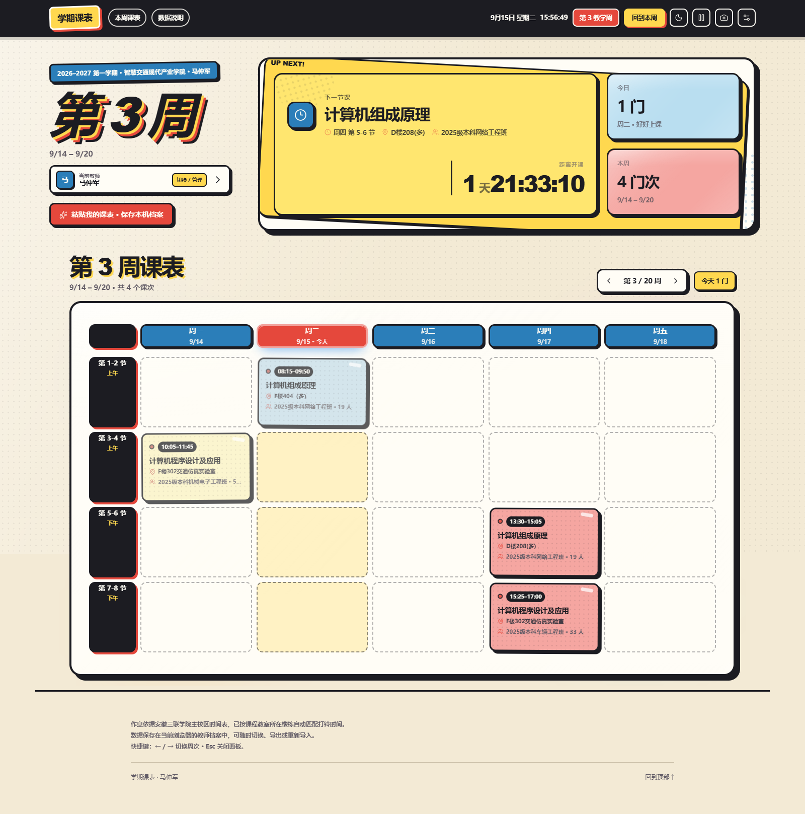
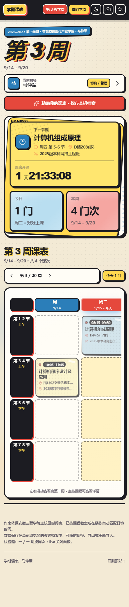

# 通用教师课表

GitHub: <https://github.com/mayanzu/teacher-timetable>

现代化的教师课表管理应用，支持多教师本机档案、教务处课表粘贴导入、教学周导航、课前提醒和随时导出备份。

在线地址（局域网）：<http://192.168.31.3:8088/>






## 功能

- 默认扫码登录教务系统，无需安装插件或提供账号密码
- 后端代理自动读取当前学期课表

- 多教师档案：同一浏览器保存多位老师课表，随时切换
- 粘贴导入：识别教务处 Markdown、网页表格和 Excel 制表符格式
- 自动解析部门、教师、星期、节次、周次、单双周、人数、教室和班级
- 教学周导航：自动计算当前周，支持上一周、下一周和回到本周
- 下一节课倒计时、今日课程和本周课次概览
- 课前浏览器通知提醒
- 教师档案 JSON 导入与导出备份
- 桌面端、移动端漫画主题
- Docker + Nginx 部署

## 技术栈

- React 19
- TypeScript
- Vite 8
- Vitest + Testing Library
- ESLint + Prettier
- Zod
- date-fns
- Lucide React
- Docker + Nginx

## 教务扫码同步

老师无需安装插件。在课程页面点击“扫码同步教务课表”后：

1. 软路由后端创建独立的教务扫码会话。
2. 页面直接显示教务系统二维码。
3. 老师使用手机扫码并确认登录。
4. 后端轮询扫码状态，在教务域名内完成登录。
5. 后端读取并解析本学期课表，将结构化数据返回前端。
6. 课表自动保存到当前浏览器的教师档案。

课表系统不会接收或保存教务账号密码。扫码 Cookie 只存在于软路由内存中的临时会话，5 分钟自动过期。

## 本地开发

```bash
npm install
npm run dev
```

默认访问 <http://localhost:5173>。

## 质量检查

```bash
npm run typecheck
npm run lint
npm test
npm run build
```

## Docker

```bash
docker compose up -d --build
```

默认映射到宿主机 `8088` 端口（容器内 Nginx 使用非特权用户，监听 `8080`）。前端镜像默认基于 `nginxinc/nginx-unprivileged:alpine`，后端容器使用 `node` 用户运行，并限制内存、进程数与能力集。

低功耗软路由建议先在本机执行 `npm run build`，再把生成好的 `dist` 交给仅含 Nginx 的运行时镜像。`compose.runtime.yaml` **不会**执行前端构建，运行前必须本地先构建：

```bash
npm run build
docker compose -f compose.runtime.yaml up -d --build
```

同步后端默认只监听 `127.0.0.1:8787`，可通过 `HOST`、`PORT`、`JWXT_ORIGIN`、`MAX_SESSIONS` 等环境变量覆盖；容器内通过 `HOST=0.0.0.0` 供 Nginx 反向代理访问。

软路由或国内环境可以复制环境变量示例并使用镜像代理：

```bash
cp .env.example .env
```

```dotenv
NODE_IMAGE=docker.m.daocloud.io/library/node:22-alpine
NGINX_IMAGE=docker.m.daocloud.io/nginxinc/nginx-unprivileged:alpine
```

## 数据模型

教师档案保存在浏览器 `localStorage`：

- `kb-teacher-profiles-v1`
- `kb-active-teacher`

每份档案包含：

- 教师、部门、学期和第一周日期
- 课程数据
- 默认作息时间
- 分楼栋作息时间

课表数据不会上传到服务器。每位老师在自己的浏览器中保存和管理课表档案。

## 目录结构

```text
server/               教务扫码同步后端

src/
├── components/        React UI 组件
├── context/           教师档案和 Toast 状态
├── data/              默认课表、作息和示例
├── hooks/             主题、提醒、本地存储等 Hooks
├── lib/               日期、课表算法、导入解析
├── services/          教务系统对接
├── styles/            模块化漫画主题样式
└── types/             TypeScript 类型
```

## License

MIT
